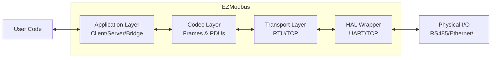

# EZModbus documentation

## Table of Contents

- [Introduction](#introduction)
- [Concept in 60 Seconds](#concept-in-60-seconds)
- [Features](#features)
- [Installation](#installation)
- [Quick Start](#quick-start)
- [Usage](#usage)
    - [Drivers](#drivers)
    - [Interfaces](#interfaces)
    - [Applications](#applications)
    - [Usage Examples](#usage-examples)
- [Memory Management Approach](#memory-management-approach)
- [Testing](#testing)
- [License](#license)
- [Contributing](#contributing)

## Introduction

EZModbus is a lightweight Modbus library designed specifically for ESP32 projects on Arduino & native ESP-IDF frameworks. Built from the ground up with C++, it aims to offers a refreshing alternative to other Modbus implementations by prioritizing user experience, flexibility and performance.

**Why EZModbus?**

If you’ve struggled with ArduinoModbus or other libraries, you’ll appreciate how EZModbus addresses common pain points:

- **Developer-friendly by design**: Eliminates common frustrations and tedious boilerplate with a simple & intuitive API. 
- **Asynchronous, event-driven design**: Built on FreeRTOS primitives (tasks, mutexes, queues, notifications) to deliver high responsiveness without continuous polling. Synchronous (blocking) & asynchronous Client API to integrate with all requirements. All public methods are thread-safe & no-lock.
- **Modular architecture**: Separates I/O, transport, codec, and application layers so you can mix and match RTU, TCP, client, server, and bridge components with minimal coupling. Support bridges between any two interfaces, several servers running on the same device sharing a single interface, as well as custom codecs & transports (e.g. Modbus JSON over HTTP) to extend its capabilities.
- **Native C++ design**: Built from scratch in C++ rather than wrapping older C libraries like FreeModbus, bringing proper type-safety with a legible & maintainable codebase.

**What can you do with EZModbus?**

- Build responsive Modbus clients that communicate with PLCs, sensors, and industrial equipment
- Create robust Modbus servers that expose your device’s functionality to industrial networks
- Bridge legacy RTU equipment to modern TCP/IP networks with minimal configuration
- Develop custom Modbus variants for specialized applications (Modbus over HTTP, Modbus to DMX…)

Whether you’re building a simple RTU thermostat client, a TCP-based greenhouse controller, or a bridge between legacy RTU devices and WiFi/Ethernet networks, EZModbus gives you the building blocks - and lets you focus on your application logic, not protocol plumbing.

## Concept in 60 Seconds

EZModbus is built around a simple workflow:

1. **Set up a transport** - Create a physical (UART/TCP) & Modbus (RTU/TCP) interface with your hardware configuration
2. **Set up the application layer** - Client (master) to initiate requests, Server (slave) to respond to them, or Bridge to connect two interfaces
3. **Link them together** - Pass the interface to your application class
4. **Initialize the physical link** - You stay in control of I/O peripherals, no hidden logic or ownership in the library
5. **Begin & let it run** - Call `begin()` on EZModbus components and FreeRTOS will take over to manage the operations in the background

## Basic Flow



Once initialized, the library handles all the low-level details:
- TX/RX tasks manage communication timing and framing
- Callbacks inform your application when data arrives
- No polling required - everything runs in background tasks

## Features

- **Dual-Mode Transport**
    - **RTU** over RS-485 via UART, optional DE/RE control
    - **TCP** over WiFi/Ethernet/netif
- **Flexible Application Layer**
    - **Client**: synchronous/blocking or asynchronous reads/writes with result trackers
    - **Server**: direct‐pointer or callback register access, automatic validation and exception handling
    - **Bridge**: link any two interfaces (RTU↔︎TCP, RTU↔︎RTU, TCP↔︎TCP) for transparent proxying
- **Standards Compliance**
    - 3.5-character silent intervals for RTU, broadcast rules, exception code semantics
    - Full coverage of all common Modbus Function Codes (0x01–0x10)
- **Pragmatic Memory Approach**
    - Zero dynamic allocation for core (HAL wrapper, Codecs, RTU/TCP transport) & Client components
    - Dynamic allocations only when needed: storage of Modbus registers and callbacks in the Server component use `std::vector` & `std::function`. The allocation is fully controlled and re-allocations at runtime are avoided.
- **Comprehensive Examples & Tests**
    - Unity-based native tests for codec, hardware loopback tests for interface & application layers

## Installation

- Clone the repo into your Arduino or IDF project’s libraries directory (e.g. `/lib` for PlatformIO).
- In your sketch, include:
    
    ```cpp
    #include <EZModbus.h>
    ```

### Dependencies

- Espressif native IDF or Arduino framework
  - ESP-IDF (tested on v5.0+)
  - or ESP32 Arduino Core (tested on v3.0+, see [pioarduino](https://github.com/pioarduino/platform-espressif32))
- C++17 or up
- FreeRTOS

## Quick Start

### Modbus Client

This example shows how to read a single holding register over Modbus RTU:

```cpp
#include <Arduino.h>
#include <EZModbus.h>

// Serial port and RS-485 DE/RE pin
#define RS485_SERIAL  Serial2
#define RS485_BAUD    9600
#define RS485_CONFIG  SERIAL_8N1
#define RS485_RX_PIN  15
#define RS485_TX_PIN  14
#define RS485_DE_PIN  5

// Target device and register
#define SLAVE_ID       1
#define REG_ADDRESS    100  // Holding register 100

// Instantiate UART, interface and client
ModbusHAL::UART         uart(RS485_SERIAL, RS485_BAUD, RS485_CONFIG, 
                             RS485_RX_PIN, RS485_TX_PIN, RS485_DE_PIN);
ModbusInterface::RTU    rtu(uart, Modbus::CLIENT);
Modbus::Client          client(rtu);

void setup() {
  Serial.begin(115200);  // Debug serial

  // Initialize UART + Modbus Client
  // (launches tasks in the background)
  uart.begin();
  client.begin();

  Serial.println("✅ Modbus RTU client ready");
}

void loop() {
  // Build request frame for holding register
  Modbus::Frame request = {
    .type       = Modbus::REQUEST,
    .fc         = Modbus::READ_HOLDING_REGISTERS,
    .slaveId    = SLAVE_ID,
    .regAddress = REG_ADDRESS,
    .regCount   = 1, // Here we will read 1 register at REG_ADDRESS
    .data       = {} // No data in the request for reads
  };

  // Placeholder for response
  Modbus::Frame response;

  // Send synchronously (blocks until response or timeout)
  if (client.sendRequest(request, response) == Modbus::Client::SUCCESS) {
    auto value = response.getRegister(0); // Get the first (and only) register value
    Serial.printf("Register %d value: %d\n", REG_ADDRESS, value);
  } else {
    Serial.println("⚠️ Read failed or timed out");
  }

  delay(1000);
}
```

That’s it! Your ESP32 now reads a register every second.

### Modbus Server

Here's how to implement a basic Modbus slave/server that exposes a few registers:

```cpp
#include <Arduino.h>
#include <EZModbus.h>

// Serial port and RS-485 DE/RE pin
#define RS485_SERIAL  Serial2
#define RS485_BAUD    9600
#define RS485_CONFIG  SERIAL_8N1
#define RS485_RX_PIN  15
#define RS485_TX_PIN  14
#define RS485_DE_PIN  5

// Our server slave ID
#define SERVER_SLAVEID      1

// Create the RTU interface and server
ModbusHAL::UART      uart(RS485_SERIAL, RS485_BAUD, RS485_CONFIG,  RS485_RX_PIN, RS485_TX_PIN, RS485_DE_PIN);
ModbusInterface::RTU rtu(uart, Modbus::SERVER);
Modbus::Server       server(rtu, SERVER_SLAVEID);

// Variables that will be exposed as Modbus registers
volatile uint32_t temperature = 230;  // 23.0°C (stored as fixed-point)
volatile uint32_t humidity = 450;     // 45.0% (stored as fixed-point)
volatile uint32_t fanState = 0;       // 0=off, 1=on

void setup() {
  Serial.begin(115200);
  Serial.println("Starting Modbus Server...");
  
  // Initialize UART + Modbus Server
  // (launches tasks in the background)
  uart.begin();
  server.begin();
  
  // Register our variables as Modbus registers
  server.addRegisters({
    {Modbus::INPUT_REGISTER, 100, "Temperature", &temperature},
    {Modbus::INPUT_REGISTER, 101, "Humidity",    &humidity},
    {Modbus::COIL,           1,   "Fan",         &fanState}
  });
  
  Serial.println("Modbus server initialized!");
}

void loop() {
  // Update sensor values (in a real application, read from actual sensors)
  temperature = 230 + random(-10, 10);
  humidity = 450 + random(-20, 20);
  delay(1000); // Loop every second
}
```

No need to poll the server, it will process automatically inbound requests and fetch/update values in the background.

### Modbus Bridge

```cpp
#include <Arduino.h>
#include <EZModbus.h>
#include <WiFi.h>

// Serial port and RS-485 DE/RE pin
#define RS485_SERIAL  Serial2
#define RS485_BAUD    9600
#define RS485_CONFIG  SERIAL_8N1
#define RS485_RX_PIN  15
#define RS485_TX_PIN  14
#define RS485_DE_PIN  5

// WiFi settings
const char* ssid = "YourNetworkName";
const char* password = "YourPassword";

// Create TCP server on port 502 (standard Modbus TCP port) 
// & setup UART port with RS485 config
ModbusHAL::TCP  tcpServer(502);
ModbusHAL::UART uart(RS485_SERIAL, RS485_BAUD, RS485_CONFIG, RS485_RX_PIN, RS485_TX_PIN, RS485_DE_PIN);

// Create interfaces with complementary roles
ModbusInterface::RTU rtu(uart, Modbus::CLIENT);
ModbusInterface::TCP tcp(tcpServer, Modbus::SERVER);

// Create bridge to connect the interfaces
Modbus::Bridge bridge(rtu, tcp);

void setup() {
  Serial.begin(115200);
  Serial.println("Starting Modbus Bridge...");
  
  // Connect to WiFi
  WiFi.begin(ssid, password);
  while (WiFi.status() != WL_CONNECTED) {
    delay(500);
    Serial.print(".");
  }
  Serial.println();
  Serial.print("Connected to WiFi. IP address: ");
  Serial.println(WiFi.localIP());
  
  // Initialize TCP & UART
  tcpServer.begin();
  uart.begin();
  
  // Start the bridge, it will automatically start the interfaces
  bridge.begin();
  
  Serial.println("Modbus bridge initialized!");
}

void loop() {
  // The bridge handles everything automatically in the background
  // If you just want to let it run, you can safely delete the main task
	vTaskDelete(NULL);
}
```
The bridge will automatically forward requests & responses in both directions.

## Core Concepts

Before diving deeper, it's important to understand the key elements of EZModbus:

### `Frame` type

At the heart of EZModbus is the `Modbus::Frame` structure - a representation of a Modbus message that serves as the common language between all components of the library. It is used internally by all the application components, but you will have to manipulate it directly to be able to send and receive Modbus messages using the `Client`.

```cpp
// The core data structure you'll work with
struct Frame {
    Modbus::MsgType type;           // REQUEST or RESPONSE
    Modbus::FunctionCode fc;        // Function code (READ_COILS, WRITE_REGISTER, etc.)
    uint8_t slaveId;                // Device ID (1-247, or 0 for broadcast)
    uint16_t regAddress;            // Starting register address
    uint16_t regCount;              // Number of registers/coils to read/write
    std::array<uint16_t, 125> data; // Register values or coil states (packed)
    Modbus::ExceptionCode exceptionCode; // Error code (if any) from the slave device
};
```

#### Definition

The `Frame` structure is an enhanced representation of a raw Modbus message. It contains all the information needed to:

1. **Create requests**: Fill the fields to specify what you want to read or write
2. **Send messages**: Pass to client.sendRequest() to transmit over the network
3. **Process responses**: Examine the returned frame to extract values or check for errors
4. **Handle exceptions**: Check for Modbus protocol errors reported by slave devices

Think of a `Frame` as a bidirectional envelope for your Modbus communication. For requests, you populate it with your command details. For responses, the library fills it with the returned data, ready for your application to use.

Two aspects will make your life easier when manipulating `Frame` in Modbus client mode:

- The library automatically “enriches” the response frame so it keeps all information from the initial request. That means `regAddress`, `regCount` & `data` will match your original request even if the Modbus spec doesn’t state so (depending on the case, some of these fields aren’t part of the raw Modbus message)
- A response which is an exception will keep the original function code intact in the `fc` field. The `exceptionCode` field will hold the error code (illegal data address, slave device failure…). No need to flip bits to check if a response is an exception! Just check the value of the `exceptionCode` field: if it’s a regular response, it will be `NULL_EXCEPTION (= 0)` .

The `Frame` structure eliminates the need to understand low-level Modbus protocol details like PDUs, ADUs, coil bit packing or byte ordering - EZModbus handles all of that for you behind the scenes, and hands you a ready-to-use object filled with proper data once the response is received.

#### Reading/writing register data in `Frame`

In order to optimize memory usage without dynamic allocation, the `data` field in `Modbus::Frame` stores registers & coils in a unique array: coils are packed to occupy as little space as possible.

Register data is thus typically not accessed directly by reading or writing the `data` array, but by using a simple API that will take care of storing & retrieving data in the correct format:

##### Writing frame data

Those methods will set the `data` field of the `Frame` structure from a value or set of values :

###### During `Frame` initialization
- `packRegisters`: set frame data from a unique register value or list of registers values
  - From a vector: `packRegisters(std::vector<uint16_t> regs)`
  - From a buffer: `packRegisters(uint16_t* buf, size_t len)`
  - In place : `packRegisters(std::initializer_list<uint16_t>)`
- `packCoils`: set frame data from a unique coil state or list of coils states
  - From a vector: `packCoils(std::vector<bool> regs)`
  - From a buffer: `packCoils(bool* buf, size_t len)`
  - In place: `packCoils(std::initializer_list<bool>)`

Out of convenience, `packCoils` also include overloads for `uint16_t` in addition to `bool`, where any non-zero value will be considered as a `true` state.

###### After `Frame` initialization
- `Frame::setRegisters`: set frame data & register count from a unique or list of registers 
- `Frame::setCoils`: set frame data & register count from a unique or list of coils 

The types used for arguments are the same as the `packXXX()` methods.

###### Examples

```cpp
// From initializer list, in place
Modbus::Frame request = {
    .type = Modbus::REQUEST,
    .fc = Modbus::WRITE_REGISTER,
    .slaveId = 1,
    .regAddress = 100,
    .regCount = 4,
    .data = Modbus::packRegisters({100, 83, 94, 211})
};

// From a vector, in place
std::vector<bool> coils = {true, false, true, true, false};
Modbus::Frame request = {
    .type = Modbus::REQUEST,
    .fc = Modbus::WRITE_COILS,
    .slaveId = 1,
    .regAddress = 20,
    .regCount = coils.size(),
    .data = Modbus::packCoils(coils)
};

// From a buffer, after init
uint16_t values[10] = {100, 101, 102, 103, 104, 105, 106, 107, 108, 109};
Modbus::Frame request;
request.setRegisters(values, (sizeof(values) / sizeof(values[0])));
...
```

##### Reading frame data 

Those methods will recover the data from a struct, either for a specific register or all of them:

###### Reading a specific register

- `Frame::getRegister(size_t idx)`: returns a `uint16_t` with the register value at index `idx`
- `Frame::getCoil(size_t idx)`: returns a `bool` with the coil state at index `idx`

###### Fetching all registers

- `Frame::getRegisters()`: returns all registers values
  - To a vector: `Frame::getRegisters()` returns a `std::vector<uint16_t>`
  - To a buffer: `Frame::getRegisters(uint16_t* buf, size_t len)` writes registers values into the provided buffer & returns a `size_t` with the number of registers actually fetched
- `Frame::getCoils()`: returns all coil values
  - To a vector: `Frame::getCoils()` returns a `std::vector<bool>`
  - To a buffer: `Frame::getCoils(bool* buf, size_t len)` writes coil states into the provided buffer & returns a `size_t` with the number of coils actually fetched

###### Examples

```cpp
// REGISTERS EXAMPLES

Modbus::Frame registerResponse;

// Get register value at index 4
// (returns 0 if the index is out of bounds -> make sure the index is valid!)
uint16_t regValue = registerResponse.getRegister(4);

// Copy data into a vector
// (returns an empty vector if regCount is 0)
std::vector<uint16_t> regValues = registerResponse.getRegisters();

// Copy data into a buffer 
// (returns the number of elements actually copied)
uint16_t buffer[10];
size_t copied = registerResponse.getRegisters(buffer, (sizeof(buffer) / sizeof(buffer[0])));


// COILS EXAMPLES

Modbus::Frame coilResponse;

// Get coil value at index 2 
// (returns false if the index is out of bounds -> make sure the index is valid!)
bool coilValue = coilResponse.getCoil(2);

// Copy data into a vector
// (returns an empty vector if regCount is 0)
std::vector<bool> coilValues = coilResponse.getCoils();

// Copy data into a buffer
// (returns the number of elements actually copied)
bool buffer[10];
size_t copied = coilResponse.getCoils(buffer, (sizeof(buffer) / sizeof(buffer[0])));
```

**Note:** Technically, for registers it is possible to read/write the `data` field directly since they are not packed, but using those methods for both registers & coils will guarantee 100% validity of the data stored in the `Frame`, so they are strongly recommended!

### `Register` type

The `Modbus::Server::Register` structure is the server-side counterpart to the `Frame` structure. While a `Frame` represents a Modbus message in transit, a `Register` defines how your server exposes and manages data for Modbus clients to access.

```cpp
struct Register {
    Modbus::RegisterType type;    // COIL, DISCRETE_INPUT, etc.
    uint16_t address;             // Modbus address of this register
    const char* name;             // Optional human-readable name
    
    // Two ways to expose/access data:
    // 1. Direct pointer to a variable
    volatile uint32_t* value;     // Accessed directly by the Modbus server
    // 2. Use callbacks for dynamic behavior
    ReadCallback readCb;          // Function called for a READ request
    WriteCallback writeCb;        // Function called for a WRITE request 
};
```

The `Register` structure embodies three core principles that make EZModbus’s server implementation powerful and flexible:

1. **Direct Variable Binding**: Link Modbus registers directly to your application variables
2. **Dynamic Behavior via Callbacks**: Add custom logic for reading and writing
3. **Metadata for Organization**: Keep your code maintainable with descriptive names

More detail about this on the relevant section below.

### `Result` Type

EZModbus provides comprehensive error handling through a structured `Result` enumeration system. Each component in the library has its own dedicated `Result` type, serving as a clear indicator of operation status. Errors are not only detected but also clearly communicated throughout the entire stack (most public methods in EZModbus use this return type).

#### Consistent and Clear Error Reporting

The `Result` enumeration follows a consistent pattern across all components, see this example with `Modbus::Client::Result`:

```cpp
enum Result {
    SUCCESS,              // Success is always 0
    NODATA,               // Only for Client (request in progress)
    ERR_INVALID_FRAME,    // Error codes...
    ERR_BUSY,
    ERR_TX_FAILED,
    ERR_TIMEOUT,
    ERR_INIT_FAILED,
    ...
};
```

Every component includes a `toString()` method that converts these numeric codes into human-readable messages:

```cpp
static constexpr const char* toString(const Result result) {
    switch (result) {
        case SUCCESS: return "success";
        case NODATA: return "no data (ongoing transaction)";
        case ERR_INVALID_FRAME: return "invalid frame";
        case ERR_BUSY: return "busy";
        case ERR_TX_FAILED: return "tx failed";
        case ERR_TIMEOUT: return "timeout";
        case ERR_INIT_FAILED: return "init failed";
        ...
        default: return "unknown error";
    }
}
```

This approach eliminates ambiguity in error reporting and simplifies debugging by providing immediate clarity on what went wrong.

#### Error Propagation Through Layers

EZModbus propagates errors through its layered architecture. When a low-level error occurs (such as in the transport layer), it doesn't get lost or obscured - it propagates up through the stack until it reaches your application code.

For example, if a CRC check fails in the RTU interface, this error is passed to the client, which then returns it to your code. This clear propagation path means you always know exactly where and why an operation failed.

Error that are never catched (such as invalid request to the Modbus server which is never polled) also trigger a log trace. Indeed, EZModbus includes utility functions that enhance error reporting when debug mode is enabled (defined by the `EZMODBUS_DEBUG` flag). When debug is enabled, these helpers provide a lightweight "stack trace" that shows exactly where an error occurred. For instance, you might see log messages like:

```
[ModbusCodec.h::isValidFrame:203] Error: invalid function code
[ModbusClient.cpp::sendRequest:141] Error: invalid frame (invalid fields)
```

This tells you not only that the frame submitted is invalid, but exactly which function encountered it and why. This capability makes troubleshooting substantially easier. More detail about this in the `Logging/debugging` section below.

#### Simplified Error Checking

The `Result` system is designed for straightforward error handling:

- All success codes are `0` (`SUCCESS`)
- For the Client, there's a special `NODATA` code (`1`) indicating an ongoing transaction (i.e. response data not yet received)
- All other codes represent errors

This simplifies conditional checks in your code:

```cpp
auto result = client.sendRequest(request, response);
if (result != Modbus::Client::SUCCESS) {
    // Handle error
    Serial.printf("Error: %s\n", Modbus::Client::toString(result));
    return;
}
// If you reach here, the call to sendRequest has been successful
```

#### Always Check & Handle Return Values!

It's **strongly recommended** to check the return value of every function call, including `begin()` initialization functions. Some errors only become apparent at runtime, and failing to check for these can lead to subtle bugs.

```cpp
// Error check & error message printing at initialization
auto clientInitRes = client.begin();
if (clientInitRes != Modbus::Client::SUCCESS) {
    Serial.printf("Failed to initialize Modbus client: %s\n", Modbus::Client::toString(clientInitRes));
    while (1) { delay(1000) }; // Halt
}
```

This approach significantly simplifies troubleshooting when issues arise without burdening the code with unnecessary complexity or overhead.

### Registers Type & Function Codes Support

Both client & server supports all four Modbus register types with appropriate read/write permissions:

- `COIL` (digital outputs, read-write)
- `DISCRETE_INPUT` (digital inputs, read-only)
- `HOLDING_REGISTER` (analog outputs, read-write)
- `INPUT_REGISTER` (analog inputs, read-only)

The function codes supported are the following:

- `READ_COILS` (FC01)
- `READ_DISCRETE_INPUTS` (FC02)
- `READ_HOLDING_REGISTERS`(FC03)
- `READ_INPUT_REGISTERS` (FC04)
- `WRITE_COIL` (FC05)
- `WRITE_REGISTER` (FC06, for holding registers)
- `WRITE_MULTIPLE_COILS` (FC15)
- `WRITE_MULTIPLE_REGISTERS` (FC16, for holding registers)

They are described in the `Modbus::FunctionCode` enum and can be handled in plaintext in user code. Inconsistent data trigger explicit errors, such as `ERR_INVALID_REG_COUNT` when trying to use a “single write” function code while supplying several register values.

Out of simplicity, the function code for “Diagnostics” and “Read/Write multiple registers” have not been implemented, the current features covering most common use cases for interfacing with industrial systems.

### Modbus Role semantics

Since Modbus is a request/response protocol, the `Modbus::Role` defines whether a device is acting as a consumer (the one sending requests) or a provider (the one responding to requests) of Modbus data. Normally, this type is passed as argument when initializing an interface and does not need to be used later on.

Historically, Modbus RTU systems used traditional `MASTER` / `SLAVE` semantics while more recent Modbus TCP devices opted for `CLIENT`/`SERVER` , closest to networking logic. In EZModbus, both work :

- `MASTER` and `CLIENT` are aliases pointing to the same value
- `SLAVE` and `SERVER` as well

## Usage

### Drivers

EZModbus introduces HAL (Hardware Abstraction Layer) wrappers that act as UART & TCP drivers separating physical peripheral management from Modbus protocol logic. This design provides framework independence, event-driven responsiveness, and user control over hardware interfaces. 

#### Design Philosophy

**Framework Independence**
- Works natively with ESP-IDF without Arduino dependencies
- Full backward compatibility with Arduino Serial objects (UART)
- Extensible architecture for future platform support

**Event-Driven Approach**
- FreeRTOS event handling eliminates continuous polling
- Asynchronous timeout management and frame detection
- Maximum responsiveness with minimal CPU overhead when idle

**User Control**
- Complete control over physical interfaces
- No hidden peripheral initialization
- Transparent configuration and error handling

#### Components

**ModbusHAL::UART** - UART/RS485 driver
- Encapsulates UART driver configuration and RS485 direction control
- Compatible with both Arduino `HardwareSerial` objects and native ESP-IDF
- Automatic 3.5T silence detection and DE/RE timing with built-in ESP UART API

**ModbusHAL::TCP** - TCP socket driver
- Native ESP-IDF socket handling with event-driven architecture
- Automatic connection management and reconnection logic
- Support for both client and server modes

#### Usage Pattern

The drivers replace manual peripheral initialization:

##### UART/RS485 - Traditional approach (Arduino style)

```cpp
// Serial parameters
uint32_t RS485_BAUD_RATE = 9600;
uint32_t RS485_CONFIG = SERIAL_8N1;
uint8_t RS485_RX_PIN = 16;
uint8_t RS485_TX_PIN = 17;
uint8_t RS485_DE_PIN = 2;

// With default pins
Serial2.begin(RS485_BAUD_RATE, RS485_CONFIG);

// With custom pins
Serial2.begin(RS485_BAUD_RATE, RS485_CONFIG, RS485_RX_PIN, RS485_TX_PIN);

// Additional RE/DE pin configuration
pinMode(RS485_DE_PIN, OUTPUT);
```

##### UART/RS485 - EZModbus approach (Arduino API)

```cpp
// UART parameters
HardwareSerial RS485_SERIAL = Serial2;
uint32_t RS485_BAUD_RATE = 9600;
uint32_t RS485_CONFIG = SERIAL_8N1;
int RS485_RX_PIN = 16;
int RS485_TX_PIN = 17;
int RS485_DE_PIN = 2;

// With default pins, no RE/DE pin configuration
ModbusHAL::UART uart(RS485_SERIAL, RS485_BAUD_RATE, RS485_CONFIG);

// With default pins, additional RE/DE pin configuration
ModbusHAL::UART uart(RS485_SERIAL, RS485_BAUD_RATE, RS485_CONFIG, 
                     -1, -1, RS485_DE_PIN);

// With custom pins, no RE/DE pin configuration
ModbusHAL::UART uart(RS485_SERIAL, RS485_BAUD_RATE, RS485_CONFIG, 
                     RS485_RX_PIN, RS485_TX_PIN);

// With custom pins, additional RE/DE pin configuration
ModbusHAL::UART uart(RS485_SERIAL, RS485_BAUD_RATE, RS485_CONFIG, 
                     RS485_RX_PIN, RS485_TX_PIN, RS485_DE_PIN);

uart.begin(); // Handles all UART and RS-485 configuration
```

##### UART/RS485 - EZModbus approach (ESP-IDF API)

```cpp
// UART parameters
uart_port_t RS485_UART_PORT = UART_NUM_2;
uint32_t RS485_BAUD_RATE = 9600;
uint32_t RS485_CONFIG = ModbusHAL::UART::CONFIG_8N1;
int RS485_RX_PIN = 16;
int RS485_TX_PIN = 17;
int RS485_DE_PIN = 2;

// With default pins, no RE/DE pin configuration
ModbusHAL::UART uart(RS485_UART_PORT, RS485_BAUD_RATE, RS485_CONFIG);

// With default pins, additional RE/DE pin configuration
ModbusHAL::UART uart(RS485_UART_PORT, RS485_BAUD_RATE, RS485_CONFIG, 
                     -1, -1, RS485_DE_PIN);

// With custom pins, no RE/DE pin configuration
ModbusHAL::UART uart(RS485_UART_PORT, RS485_BAUD_RATE, RS485_CONFIG, 
                     RS485_RX_PIN, RS485_TX_PIN);

// With custom pins, additional RE/DE pin configuration
ModbusHAL::UART uart(RS485_UART_PORT, RS485_BAUD_RATE, RS485_CONFIG, 
                     RS485_RX_PIN, RS485_TX_PIN, RS485_DE_PIN);

uart.begin();  // Handles all UART and RS-485 configuration
```


##### TCP - Traditional approach (Arduino style)

```cpp
// Parameters
uint16_t TCP_SERVER_PORT = 502;                         // Local server port
IPAddress TCP_CLIENT_IP = IPAddress(192, 168, 1, 100);  // Remote server IP address
uint16_t TCP_CLIENT_PORT = 502;                         // Remote server port

// TCP server
EthernetServer tcpServer(TCP_SERVER_PORT);
tcpServer.begin();

// TCP client
EthernetClient tcpClient;
tcpClient.connect(TCP_CLIENT_IP, TCP_CLIENT_PORT);
```

##### TCP - EZModbus approach (Arduino & ESP-IDF, same API)

```cpp
// Parameters
uint16_t TCP_SERVER_PORT = 502;               // Local server port
const char* TCP_CLIENT_IP = "192.168.1.100";  // Remote server IP address
uint16_t TCP_CLIENT_PORT = 502;               // Remote server port

// TCP server
ModbusHAL::TCP tcpServer(TCP_SERVER_PORT);
tcpServer.begin(); // Handles all TCP configuration

// TCP client
ModbusHAL::TCP tcpClient(TCP_CLIENT_IP, TCP_CLIENT_PORT);
tcpClient.begin(); // Handles all TCP configuration & connection to remote server
```

The HAL objects are then passed to Modbus interfaces:

```cpp
ModbusInterface::RTU rtu(uart, Modbus::CLIENT);
ModbusInterface::TCP tcp(tcpServer, Modbus::SERVER);
ModbusInterface::TCP tcp(tcpClient, Modbus::CLIENT);
```

This separation ensures you maintain control over hardware while benefiting from optimized, event-driven peripheral management designed specifically for Modbus communication requirements.

**Note:** The driver must be properly initialized with `begin()` **before** the other Modbus components! Otherwise you will get an `ERR_INIT_FAILED` error when trying to initialize the Modbus application layer.

### Interfaces

The interface layer handles physical communication details for Modbus RTU & TCP protocols. They don't need to be initialized separately, they are automatically initialized when calling `begin()` on the application layer instances (Client, Server & Bridge).

#### RTU Interface

```cpp
// Constructor parameters:
// - ModbusHAL::UART - The UART port to use
// - Modbus::Role - CLIENT (master) or SERVER (slave)  
ModbusInterface::RTU rtuIface(uart, Modbus::CLIENT);
```
For Modbus RTU, the silence time used to detect the end of a frame (& observed after sending a frame) is automatically calculated based on the UART baud rate used to setup the UART driver. However, many third-party devices poorly implement Modbus timing specifications and might require a manual override. This is possible with the following method:

```cpp
// Optional configuration - the default silence time (based on UART baud rate) can be overridden
// (may be done before or after initializing the application layer)
rtuIface.setSilenceTimeMs(5);  // Manually set silence period - 5~10 ms generally work fine with all devices
```

#### TCP Interface

```cpp
// Constructor parameters:
// - ModbusHAL::TCP - The TCP client/server to use
// - Modbus::Role - CLIENT (master) or SERVER (slave)
ModbusInterface::TCP tcpIface(tcpClient, Modbus::CLIENT);
```
If you pass the wrong TCP HAL object type (for example a `tcpServer` for a Modbus TCP client), the `begin()` method will return an `ERR_INIT_FAILED` error.

### Applications

The application layer provides high-level Modbus functionality:

#### Client (Master)

The Modbus Client implements the master device role, initiating requests to slave devices and processing their responses. It offers both synchronous (blocking) and asynchronous (non-blocking) operation modes to suit different application needs.

##### Synchronous vs asynchronous operation

1. **Synchronous Mode** (blocking):
    - Simpler to use - request and response in one function call
    - Blocks until the response arrives or a timeout occurs
    - Perfect for sequential operations or simple applications
    
    The sync mode works exactly as in the former examples:
    
    ```cpp
    Modbus::Frame request = { /* request details */ };
    Modbus::Frame response;
    
    auto result = client.sendRequest(request, response); // Only 2 args: sync
    // sendRequest blocks until completion if no "result tracker" argument provided
    
    if (result == Modbus::Client::SUCCESS) {
      // Process response here...
    }
    ```
    
2. **Asynchronous Mode** (non-blocking):
    - Returns immediately after sending the request
    - Allows your application to continue other tasks while waiting
    - Uses a Result tracker to monitor request progress
    
    The async mode works by passing a pointer to a `Result` variable holding the transfer status while the transaction is ongoing: 
    
    ```cpp
    Modbus::Frame request = { /* request details */ };
    Modbus::Frame response;
    Modbus::Client::Result tracker; // Stores the request outcome
    
    client.sendRequest(request, response, &tracker); // 3 args: async
    // sendRequest returns immediately with `Modbus::Client::SUCCESS` 
    // if the request is valid & queued for TX 
    
    // Continue other operations while request is processed in background...
    
    if (tracker == Modbus::Client::NODATA) {
     // Request is still being processed...
    } else if (tracker == Modbus::Client::SUCCESS) {
     // Process response here...
    } else {
     // Handle error or timeout...
    }
    ```

##### Understanding the Request Result Tracker

The request result tracker is a key concept that makes asynchronous operations manageable:

- It’s a simple integer variable (`Modbus::Client::Result` enum) you provide to the client
- It is automatically set to `NODATA` after the request is accepted
- The client updates its value automatically as the request progresses through its lifecycle
- You can check it at any time to determine the current state without callbacks
- The variable is updated from an internal task, so it’s always current

In asynchronous mode, when `sendRequest()` returns `SUCCESS`, it just indicates it was accepted & queued for transmission. The actual outcome of the operation is notified via the callback mechanism after the response is received (or in case of timeout or other transmission errors) and will update the tracker accordingly.

##### Important note about variable lifetime

In asynchronous mode, it is the user’s responsibility to **ensure both the response placeholder & the tracker are valid throughout the whole request lifecycle**! Otherwise, a crash may occur as the library could try to access dangling memory locations. Once the tracker has updated to any other value than `NODATA`, it is safe to release the objects.

##### Managing Multiple Devices

The client is designed to work with multiple slave devices on the same bus:

- Simply change the `slaveId` field in your request frame for each device
- Wait for each request to complete before sending the next one (Modbus is sequential) for example by testing the `Client` status with the `isReady()` method (or retrying if `sendRequest()` returns `ERR_BUSY`)
- For broadcast messages (slaveId 0), no response is expected and the status proceeds directly to `SUCCESS` after the TX fully completes.

##### Error Handling and Diagnostics

The client provides several tools for effective error handling:

1. **Result Enum** - From synchronous calls or stored in the result tracker:
    - `SUCCESS` - Operation completed successfully
    - `ERR_INVALID_FRAME` - Request was malformed or invalid
    - `ERR_BUSY` - Another transaction is in progress
    - `ERR_TX_FAILED` - Failed to transmit request
    - `ERR_TIMEOUT` - No response received within timeout
    - `ERR_INVALID_RESPONSE` - Received response was invalid
2. **Exception Detection** - Modbus protocol exceptions from the slave can be easily decoded with the `toString` method:
    
    ```cpp
    if (response.exceptionCode != Modbus::NULL_EXCEPTION) {  
    	Serial.printf("Slave reported exception: %s\n",
                     Modbus::toString(response.exceptionCode));
    }
    ```
    
3. **Debug Mode** - When `EZMODBUS_DEBUG` is defined, detailed logs show frame contents and round-trip timing.

##### Handling Broadcast Requests

Modbus allows broadcast messages that are received by all slaves but not acknowledged:

- Set `slaveId` to 0
- Only write operations are valid for broadcast (per Modbus specification)
- The client will not wait for a response and will complete immediately
- Use for operations like resetting multiple devices or synchronizing actions

Broadcast operations can significantly reduce bus traffic when updating multiple devices, but come with no guarantee that all devices received the message correctly.

##### Setting Custom Request Timeout

The client enforces a timeout: if a response isn’t received within this timeframe, the request will be closed (marked as `ERR_TIMEOUT`), and the client layer will be ready to accept a new request. The default round-trip timeout is 1 second (`DEFAULT_REQUEST_TIMEOUT_MS` constant). For convenience, you can select another timeout when instanciating the client :

```cpp
Modbus::Client client(rtu, 5000); // Use a 5 second timeout
```

### Server (Slave)

The Modbus Server implements the slave device role, responding to requests from client devices. It maintains an internal register map and handles request validation automatically.

To operate the server, you just need to use the `addRegister()` or `addRegisters()` methods. It doesn’t matter if they are called before or after the call to `server.begin()`.

#### Register Access Methods

The server supports two complementary approaches to register access. Out of simplicity, registers & coils are treated equally type-wise, a non-zero value indicating a `true` state for a coil or discrete input.

1. **Direct Value Pointers**:
    - Simply provide a pointer to an existing variable (`volatile uint32_t`) in your code
    - The server will read from and write to this variable automatically
    - Best for straightforward data that’s already stored in variables
    - Very efficient with minimal overhead

The `uint32_t` type here is used to ensure atomicity despite Modbus registers use 16-bits values. Indeed, if your user code modifies a variable at the same time the server is trying to read it, there is a risk of corruption. On the ESP32's 32-bit architecture this approach avoids any conflicts (N.B.: it will be internally clamped to `UINT16_MAX = 65535` at access time so there is no risk of wraparound if your value exceeds 65535). Also, using `volatile` variables ensure you always return the last updated (uncached) value. 

```cpp
volatile uint32_t temperature = 0;

Modbus::Server::Register reg = {
  .type = Modbus::INPUT_REGISTER,
  .address = 100,
  .name = "Temperature",
  .value = &temperature
};
server.addRegister(reg);
 
// Later in your code:
temperature = getSensorReading() * 100;  // Update the value any time
```

**Thread safety note**: Using `volatile uint32_t` ensures atomic access and prevents data corruption, making it safe for most use cases like sensor readings or simple status values. However, if you're updating multiple related registers or need strict timing guarantees, you should be careful as there is still a risk of conflict when both the server and your code are **writing** to the same variable at the same time (holding registers & coils). Consider using callbacks with proper synchronization instead, or separate read-only registers (written only from your code) & R/W registers (written only from the server).
    
2. **Callback Functions**:
    - Provide custom read and/or write functions
    - Allows for dynamic values, validation, transformations, or side effects
    - Perfect for values that need calculation, validation, or triggering actions
    - Slightly more overhead, but offers maximum flexibility
    - You can implement synchronization logic in your callbacks if needed

Your read callbacks must return an `uint16_t` value, and your write callbacks must return a `bool` that indicates whether the write succeeded (generally always `true`, or `false` to return a `SLAVE_DEVICE_FAILURE` exception).
    
```cpp
server.addRegister({
   .type = Modbus::HOLDING_REGISTER,
   .address = 200,
   .name = "Setpoint",
   .readCb = [](const Modbus::Server::Register& reg) {
     return getSetpoint();  // Could perform calculations here
   },
   .writeCb = [](uint16_t value, const Modbus::Server::Register& reg) {
     return setSetpoint(value);  // Validate, save, and trigger effects
   }
 });
```
    
#### Important notes on callbacks usage 
    
- The callbacks are called in the context of the Modbus server task, so they must be fast and not block. Design them like you would do for an ISR ; if there’s intensive processing to do, consider offloading it to a background task.
- For read-only register types, the `writeCb` must not be provided, otherwise this will trigger an error when calling `addRegister()`.
- If you specify both a value pointer AND callbacks, the latter will be ignored, and the server will process all incoming requests by using your value pointer.
- If you try to add an already-existing register, it will be silently overwritten.

#### Adding Multiple Registers At Once

To ease the initialization process, the `addRegisters()` method does the same thing but takes a `std::vector<Register>&` as argument. Create a vector, add your registers, call the method and you’re done! 

Important note: this method is atomic, which means all registers will be added or none. If there’s a validation issue with **any** of the registers you submit, it will return an error (`ERR_REG_...`) and no register will be stored consequently. The log trace will display which invalid register returned the error first:

```
[ModbusServer.cpp::addRegisters:110] Error: missing read callback (holding register 23)
```

However, like for the single register add method, subsequently adding the same register will result in only the latest remaining valid.

#### Register Context in Callbacks

A powerful feature of EZModbus callbacks is that they provide the full register context as a parameter:

- The `Register&` parameter contains all metadata about the register being accessed
- This includes its type, address & name
- You can use this context for:
    - **Sharing callbacks** between multiple registers
    - **Logging** which register triggered the callback
    - **Dynamic behavior** based on register properties
    - **Mapping** between register addresses and application logic

Example of a shared callback using the register context:

```cpp
// A single callback function handling multiple registers
auto sharedReadCb = [](const Modbus::Server::Register& reg) {
  // Log which register is being read
  Serial.printf("Reading register %s (addr: %d)\n", 
                reg.name, reg.address);
  
  // Different behavior based on register address
  switch (reg.address) {
    case 100: return getSensorValue(SENSOR_TEMP);
    case 101: return getSensorValue(SENSOR_HUMIDITY);
    case 102: return getSensorValue(SENSOR_PRESSURE);
    default:  return 0;
  }
};

// Register multiple registers with the same callback
server.addRegister({Modbus::INPUT_REGISTER, 100, 
                   "Temperature", nullptr, sharedReadCb});
server.addRegister({Modbus::INPUT_REGISTER, 101, 
                   "Humidity", nullptr, sharedReadCb});
server.addRegister({Modbus::INPUT_REGISTER, 102, 
                   "Pressure", nullptr, sharedReadCb});
```

Even if you don’t use the register context parameter in your callback, it must be included in the function signature for the callback to be compatible with the server.

#### Rejecting Undefined Registers

In the Modbus specification, access to undefined registers should result in an `ILLEGAL_DATA_ADDRESS` exception. However, if you have holes in your register table and both devices clearly know the correct set of registers to use, it might be more efficient to just ignore those requests (i.e. return a 0 value) and proceed with the rest of the transaction, so that you could poll a whole range of registers at once with a multiple `READ_HOLDING_REGISTERS` request (for example) request instead of `n` individual requests.

By default, the EZModbus server *does reject* calls to undefined registers with an exception, but you can disable this behavior by instanciating the server object with an additional argument:

```cpp
Modbus::Server server(iface, 0); // 0 = no exception on undefined registers
```

#### Unit ID for Modbus TCP

Modbus TCP devices are normally not addressed using the traditional `slaveId` field, but by their port and IP address. 
A `Unit ID` field exists in the Modbus TCP protocol, and is used to relay Modbus requests to other RTU devices that own use the `slaveId` field.

To make it work correctly, TCP manages the `slaveId` field as follows:
- The TCP codec does not check the `slaveId` field in neither direction, so it can be set to any value (even up to 255 i.e. above the Modbus RTU limit of 247)
- When used with a TCP interface, the server will accept any Unit ID value (with RTU, it will discard requests that do not match its own `slaveId` except for broadcast requests)
- Broadcast requests (`slaveId` 0) are still handled correctly (response is dropped, request is completed right after handling the frame to the application layer)

In short, you don't have to worry about the `slaveId` field when starting a Modbus TCP server :
- The server will accept any Unit ID in received request, and will echo it back in the response
- The client will accept to send request to hosts with any Unit ID value even above the Modbus RTU limit of 247
...which is exactly the expected behaviour for Modbus TCP applications.

When connecting a TCP interface to an EZModbus Bridge, the Unit ID received will become the `slaveId` on the RTU side, and vice-versa. 

#### Register Memory Reservation

Internally, the Modbus server uses `std::vector<Register>` tables (one for each register type) to store (when using `addRegister`) and fetch them (when receiving a request). The intention is to optimize memory use by not statically allocating a large register table (eating up a huge amount of RAM to store the 4x 65535 max registers) when most applications use only a few dozens, but also, ensure lighting-fast access to the registers even if there’s “hole” in the tables, thanks to binary search in the vector.

By default, the server only reserves enough RAM to store 100 registers (`RSV_REGISTERS` constant) but there is no hard limit. However, this means the register table might be reallocated at each subsequent call to `addRegister` past `RSV_REGISTERS`. To avoid this, the appropriate quantity of heap memory can be pre-allocated using the `setRegisterCount` method:

```cpp
// We reserve enough memory to store 1000 holding registers
server.setRegisterCount(HOLDING_REGISTER, 1000);
// Now, let's add our registers...
server.addRegisters(someRegisterTable);
```

### Bridge

The Modbus Bridge is a powerful component that transparently connects two different Modbus interfaces, allowing seamless communication between networks or protocols. This is ideal for integrating legacy RTU devices with modern TCP networks, or creating protocol converters for industrial environments.

#### Core Functionality

The Bridge acts as a bidirectional proxy between two interfaces:

- It forwards requests from a master interface to a slave interface
- It returns responses from the slave interface back to the master
- It preserves the original message content while converting the protocol format
- No programming logic is required beyond setup - forwarding happens automatically

#### Interface Requirements

The Bridge requires interfaces with complementary roles:

- One interface must be configured as `CLIENT`/`MASTER`
- The other interface must be configured as `SERVER`/`SLAVE`
- Both interface are initialized by calling the bridge’s `begin()` method
- The roles determine the direction of request and response forwarding

It relies on the same interface components as you would use for a client or server, so it works entirely in the background without polling or busy-waiting, efficiently utilizing system resources.

Implementation Example:

```cpp
// Create instances of your physical interfaces with HAL
ModbusHAL::UART uart(RS485_SERIAL, RS485_BAUD, RS485_CONFIG);
ModbusHAL::TCP  tcpServer(PORT);

// Create interfaces with complementary roles
ModbusInterface::RTU rtuIface(uart, Modbus::CLIENT);  // RTU as master
ModbusInterface::TCP tcpIface(tcpServer, Modbus::SERVER);  // TCP as slave

// Initialize physical interfaces
uart.begin();
tcpServer.begin();

// Create and initialize bridge
Modbus::Bridge bridge(rtuIface, tcpIface);
bridge.begin();

// That's it! All communication now flows automatically
// Your loop() can focus on other application tasks
```

#### Note on Bridge Configuration

When setting up a Modbus bridge to connect different networks, there are two critical concepts to understand:

- The bridge relies on the underlying interfaces, which means it follows the same sequential request pattern - **only one transaction can be active at a time**. This is a fundamental limitation of the Modbus protocol itself, not specific to EZModbus. If you have multiple TCP clients trying to communicate through the bridge simultaneously, the first arrived will be served, others will receive a `SLAVE_DEVICE_BUSY` exception. In RTU mode this should not happen since a multi-master topology is forbidden as per the Modbus specification (and not recommended anyway due to the RS485 half-duplex nature).
- When configuring the bridge, you must think from the perspective of your connection **relative to the host (microcontroller running EZModbus)**, not from the perspective of the device itself:
    - If you’re connecting to a Modbus slave device (like a sensor or actuator), that segment of your bridge must be configured as `MASTER`/`CLIENT`
    - If you’re connecting to a Modbus master device (like a PLC/SCADA system), that segment of your bridge must be configured as `SLAVE`/`SERVER`

This often creates confusion because you need to configure the interface with the **opposite role** of the device you’re connecting to:

```cpp
// CORRECT CONFIGURATION:
// Connecting to a SLAVE device over RTU, and exposing it to TCP masters
// 1. RTU as CLIENT to talk to a SLAVE
ModbusInterface::RTU rtuIface(uart, Modbus::CLIENT);  
// 2. TCP as SERVER to accept connection from CLIENTS
ModbusInterface::TCP tcpIface(tcpServer, Modbus::SERVER);  

// INCORRECT (wouldn't work):
// ModbusInterface::RTU rtuIface(uart, Modbus::SERVER);
```

### Multiple Applications with Shared Interfaces

#### Connecting Multiple Components to a Single Interface

EZModbus’s modular design allows you to connect multiple application components to the same physical interface, offering flexible configurations for complex scenarios.

#### Server: Multiple Servers on One Interface

**✅ Fully Supported and Recommended (RTU ONLY)**

You can easily create multiple server instances on a single physical RTU interface, each responding to different Slave IDs:

```cpp
// Create one UART & RTU interface using Serial2
ModbusHAL::UART uart(Serial2, 9600, SERIAL_8N1);
ModbusInterface::RTU rtuIface(uart, Modbus::SLAVE);

// Create multiple servers with different Slave IDs
Modbus::Server temperatureServer(rtuIface, 1);  // Responds to Slave ID 1
Modbus::Server humidityServer(rtuIface, 2);     // Responds to Slave ID 2
Modbus::Server controlServer(rtuIface, 3);      // Responds to Slave ID 3

// Initialize everything
uart.begin();
temperatureServer.begin();
humidityServer.begin();
controlServer.begin();
```

This approach is ideal for:

- Organizing different device functions into separate logical units
- Mimicking multiple physical devices from a single ESP32
- Creating clear separation between different register sets

**❌ Not Supported or Needed (TCP)**

As stated before, the TCP server will totally ignore the `slaveId` field. It means ALL TCP servers sharing the same interface will be handed the requests received by the interface, and they will all try to respond it, which will create a conflict.

**Only one TCP server can be connected to a single interface.** If you need to run several Modbus TCP servers on the same device, the correct way is to use different TCP servers and use a different port for each server.

#### Client: Multiple Clients on One Interface

**⚠️ Possible but Not Standard (RTU ONLY)**

While the Modbus specification doesn’t formally support multiple masters on the same bus, EZModbus doesn’t enforce this limitation at the software level:

```cpp
// Create one UART & RTU interface
ModbusHAL::UART uart(Serial2, 9600, SERIAL_8N1);
ModbusInterface::RTU rtuIface(uart, Modbus::MASTER);

// Create multiple clients
Modbus::Client temperatureClient(rtuIface);
Modbus::Client controlClient(rtuIface);

// Initialize everything
uart.begin();
temperatureClient.begin();
controlClient.begin();
```

**Important Note**: only one client can issue a request at a time. The others will get an `ERR_BUSY` error when calling `sendRequest()`.

**✅ Supported (TCP)**

The TCP HAL wrapper manages sockets independently, so you can have as many clients as you want on a single interface. However, only one TCP transaction can be active at a time, so you need to make sure to wait for the previous request to complete before sending a new one, or you will get an `ERR_BUSY` error when trying to send it.

#### Bridge: Multiple Bridges & Combination of Bridge and Client/Server

**❔ Possible: Combination of Bridge and Client/Server**

Each end of the bridge being a proper client or server, you can totally mix bridge and client/server on the same interface, as long as the case you are trying to achieve is supported by the previous statements.

For example, you could have a unique TCP/UART connection to a bus formed of multiple slave devices, and access some of those devices from your code, as well as exposing the bus to external TCP clients through the bridge. However, the same limitations apply: only one request can be ongoing at a time.

You could even chain two bridges (even if I cannot think of a practical application of this). Just replicate the single bridge configuration and you should be good.

Just keep in mind that in bridge mode, the timeouts are still enforced by the `Client` layer: the default round trip timeout (`DEFAULT_REQUEST_TIMEOUT_MS`) is 1 second, which means any request should complete within this timeframe, otherwise any delayed response from the server will be rejected.

### Using Multiple Physical Interfaces

If you need to communicate with separate Modbus networks, simply create multiple interface instances for each physical connection:

```cpp
// Create multiple UART instances for two separate ports
ModbusHAL::UART uart1(Serial1, 9600, SERIAL_8N1);
ModbusHAL::UART uart2(Serial2, 115200, SERIAL_8E2);

// Create RTU interfaces
ModbusInterface::RTU rtuIface1(uart1, Modbus::CLIENT);
ModbusInterface::RTU rtuIface2(uart2, Modbus::SERVER, 5); 

// Create Modbus Client & Server instances
Modbus::Client client(rtuIface1);
Modbus::Server server(rtuIface2);

// Initialize UARTs & Modbus client/server instances separately
uart1.begin();
uart2.begin();
client.begin();
server.begin();
```

This approach gives you complete flexibility to connect your ESP32 to multiple Modbus networks simultaneously, with each interface operating independently.

### Logging/debugging

EZModbus includes a debug mode that can be enabled by defining the `EZMODBUS_DEBUG` flag in your project. When debug is enabled, the library will print detailed information about the Modbus protocol, including frame contents (human-readable output & raw hexdumps from the Codec layer), round-trip timing and errors (more on this earlier in the `Result` type section).

To enable debug, set the flag in your project's `main.cpp` file:

```cpp
#define EZMODBUS_DEBUG
```

Or on PlatformIO, in the `platformio.ini` file:

```ini
build_flags = -D EZMODBUS_DEBUG
```

Due to the multi-threaded nature of the library, EZModbus uses a custom thread-safe logging (`Modbus::Logger`) internally, through log helpers defined in an utility file (`ModbusDebug.h`). When debug is disabled, the methods are all neutralized by the define flags, in order to completely remove any overhead (even evaluating strings in `LOG_X()` arguments). This was chosen instead of the native ESP logging system due to its overhead.

By default, logs are printed to the default Serial port on Arduino (`Serial`, usually USB CDC on most ESP32 boards) or `UART_NUM_0` port for ESP-IDF. You can redirect them with the `EZMODBUS_LOG_OUTPUT` flag (in your code right before including `EZModbus.h` or in your `platformio.ini` file):

```cpp
// In your code:
#define EZMODBUS_LOG_OUTPUT Serial1 // Prints logs to Serial1
```

```ini
; In your platformio.ini:
build_flags = -D EZMODBUS_LOG_OUTPUT=Serial1 ; Prints logs to Serial1
```

## Usage Examples

A broad set of examples is available in the lib folder, check the `/examples` directory:

- `/client`: Modbus RTU & TCP clients
- `/server`: Modbus RTU & TCP servers
- `/bridge`: Modbus RTU↔TCP bridge

There are also two additional folders for examples showcasing the flexibility of EZModbus to develop other applications based on the Modbus protocol:

- `/dmx`: Modbus-to-DMX server/device using the `EZDMX` library
- `/json-http`: Modbus JSON codec & HTTP server using the `ESPAsyncWebserver` & `ArduinoJson` libraries

## Memory Management Approach

### Zero Static Allocation in Core Components

EZModbus uses **zero dynamic allocation** in the codec, interfaces, and Modbus Client - completely avoiding risks related to allocation failures & heap fragmentation.

### Strategic Dynamic Allocation in Server

The Modbus Server uses controlled dynamic allocation only for the register table:

- **Memory optimization**: Allocates exactly what you need, not worst-case scenarios - only uses as much RAM as needed for the best efficiency
- **Flexible callbacks**: Enables use of `std::function` for maximum flexibility
- **Freedom of configuration**: No need to pass a static register table during instantiation, or have it defined at compile time - allows post-construction configuration
- **Controlled allocation**: Once allocated, register memory locations are stable and never move

This pragmatic approach prioritizes API simplicity and memory efficiency over rigid embedded conventions, while maintaining strict control over when and how allocations occur.

## Testing

EZModbus includes a comprehensive suite of Unity-based unit and integration tests that run on both native environments and real ESP32 hardware. The testing approach follows a progressive validation strategy:

1. **Native Codec Tests** - Validate encoding/decoding functions in a desktop environment
2. **Server + Mock Client Tests** - Validate register storage and request handling on ESP32
3. **Full Client/Server Tests** - Complete full round-trip tests with the actual EZModbus classes

For the two latter steps, we used an ESP32-S3 dev board connected in “loopback mode”:

- Server and Client tasks are allocated on two different cores for truly parallel operation
- For Modbus RTU, two physical UART interfaces are used and linked together (RX1 to TX2 and vice-versa)
- For Modbus TCP, we use the internal loopback from LwIP (127.0.0.1) so that both server and client running on the same board can communicate

### Running Tests with PlatformIO

```bash
pio test -e test_codec
pio test -e test_rtu_client_loopback
pio test -e test_rtu_server_loopback
pio test -e test_tcp_client_loopback
pio test -e test_bridge_loopback
```

### Test Coverage

Each test category ensures key functionality works as expected:

**Codec Tests**

- Encoding/decoding for all function codes
- CRC and MBAP header validation
- Error handling for malformed frames

**Server Tests**

- Register storage management
- Request handling for all function codes
- Exception generation for invalid requests

**Client Tests**

- Synchronous and asynchronous operations
- Timeout handling
- Error recovery

**Bridge Tests**

- Still quite basic, but checks bridge initialization & round-trip operation

For more details on the testing methodology, see the `test/` directory.

## License

EZModbus is released under the MIT License. See the LICENSE file for details.

## Contributing

Contributions are welcome! Please feel free to submit PRs or open issues. I'm always looking for ideas to improve EZModbus's robustness, performance, and memory usage & safety. Even without a PR, your advice and suggestions are greatly appreciated - don't hesitate to share your thoughts or expertise.